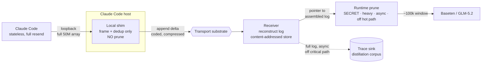

# dlr: An Append-Log Replication and Coded-Transfer Protocol for High-Volume Harness→Gateway Context

**Status:** Implemented — Rust workspace (8 crates) builds clean, 64 tests pass, end-to-end demo runs. This document is the design rationale; the code is the source of truth.
**Scope:** Moving a growing (→50M-token) Claude Code message list to a remote runtime that prunes to ~100k, without re-sending the history, without exposing the pruning algorithm, and without bottlenecking on the expensive prune.
**Audience:** systems + ML infra (Rust gateway, Baseten/GLM-5.2 backend, Nightshift multi-agent, ConnectX/BlueField fabric).

---

## 0. Thesis (read this before anything else)

The problem *feels* like "transfer 200MB efficiently," but that framing is a trap. Two facts collapse it:

1. **The client never prunes.** Claude Code's message array is strictly *append-only* — turn *N+1* is turn *N* plus a few new content blocks, forever. Pruning happens only downstream, in your runtime. From the transport's point of view you are **replicating an append-only log**, and an append-only log is never re-sent — you ship the tail.

2. **The 200MB monolith only ever exists once**, on cold resume. In steady state each turn's *novel* payload is the size of the new turn (KB), not the accumulated history (200MB+).

So the steady-state win is structural, not cryptographic and not a new wire format: **kill the re-send, replicate the delta.** That alone is ~500× on per-turn bytes and takes you to Responses-API economics on the wire while your prune stays entirely server-side.

Everything mathematical in this document optimizes what remains after that: the *cold-start bulk transfer*, *multipath/multicast fan-out*, *loss recovery*, *placement*, and *framing*. Those are where finite-field coding, low-discrepancy sequences, and group-structured topologies earn real speed — not as decoration.

**Design principle, stated once so it doesn't recur:** do **not** reinvent L4. Reliable delivery, congestion control, loss recovery, and encryption are 40 years deep and you will not beat QUIC/RDMA by hand-rolling them. Innovate at the **application layer** (log replication) and the **coding layer** (erasure/network codes), carried over a *reused* transport substrate. The one place bespoke-at-the-wire is legitimate is kernel-bypass (RDMA), which already exists as verbs — you adopt it, you don't invent it.

---

## 1. Problem statement

| Constraint | Consequence |
|---|---|
| Claude Code speaks the stateless Messages API; resends full array each turn | Cannot make the client stateful; must terminate the re-send at a hop we control |
| History grows toward 50M tokens (~200–260MB JSON) | Only ~0.2% is used per call; transferring all of it every turn is pure waste |
| Prune → ~100k must run **in the runtime** and stay **secret** | No client-side prune; no prune logic on any wire; algorithm lives only in our compiled binary |
| The accurate prune is **computationally heavy** | It must run **off the transfer hot path**, pipelined on dedicated compute, never blocking reconstruction or transport |
| Downstream window is GLM-5.2 @ 1M (DSA sparse attn) | 100k is trivial to serve; inference-side is a non-issue once we prune correctly |

**Goal:** per-turn wire cost ≈ size of the new turn; cold-start ≈ one-time resumable coded stream; prune runs at full fidelity, asynchronously, revealing nothing.

---

## 2. Architecture overview



**Data-flow contract:**

- Claude Code → **loopback** → shim. Full 50M array crosses *localhost only*: no WAN, no size ceiling on that hop, cost is a CPU/memory spike (deserialize ~200MB JSON), not bandwidth.
- Shim does **framing + dedup + coding only**. It never prunes; it holds no policy. Dedup is over opaque bytes/hashes and reveals nothing.
- Shim → receiver over the **expensive/limited hop**, carrying only the **append delta** (KB/turn) or, on cold start, a **coded bulk stream**.
- Receiver **accumulates** the per-session log in a content-addressed store and hands the runtime a *pointer*, never a rebuild.
- Runtime prune runs **async, on dedicated compute, off the transfer path** → 100k to Baseten.
- Full log **forks async** to the distillation sink so "capture everything" and "feed the model" never share a request.

The rest of this document specifies each layer, with the mathematics attached where it does real work.

---

## 3. Core protocol: append-only Merkle-DAG log replication

### 3.1 Unit of replication

Not byte-CDC chunks — you already have exact JSON boundaries. The unit is the **semantic content block** (message / tool-call / tool-result block). Each block:

```
block_id   = BLAKE3(canonical_bytes(block))      // 256-bit
```

The conversation is a **Merkle DAG**: `root_N = BLAKE3(root_{N-1} ‖ block_id_N ‖ … )`. The root is a single 32-byte commitment to "we agree on everything up to here."

BLAKE3 runs multi-GB/s; hashing a 200MB cold-start payload is single-digit milliseconds — orders of magnitude under your accurate-prune latency, so dedup is never the bottleneck.

### 3.2 Steady-state frame

```
APPEND {
  session_id : u128
  base_root  : [u8;32]        // last root the receiver ACKed
  blocks     : [Block]        // only blocks since base_root
  coeff_hdr  : optional       // present if network-coded (§6.5)
}
```

Receiver appends, recomputes `root`, ACKs `root`. No 100k-entry manifest on the hot path — the single `base_root` says "we already agree up to here." Per-turn bytes = size of the new turn. **This is the whole steady-state win.**

### 3.3 Resync / cold start (the only full transfer)

Triggered when client and receiver roots diverge, or on a cold gateway:

1. Client sends the ordered `block_id` list (≈3k × 32B for a 50M-token log ≈ ~100KB manifest).
2. Receiver names the missing set (usually all, on cold start).
3. Client streams the missing blocks **as a coded, resumable bulk transfer** (§6.4).

Because it's content-addressed and chunked, **no single request approaches the 32MB buffered-body ceiling**, and a dropped connection resumes mid-stream instead of restarting 200MB. The Merkle root is the free end-to-end integrity check.

---

## 4. Where the pruning cost is hidden (critical)

The heavy, accurate prune is **decoupled from transport by construction**:

- Transport + reconstruction are **cheap and continuous** (append + hash + store).
- The receiver hands the runtime a **stable pointer** to the assembled log.
- The prune runs on **its own compute pool**, pipelined, producing 100k windows asynchronously. A slow prune backpressures *inference scheduling*, never the *wire*.

This is the direct answer to "the good prune is too slow to run on the gateway": it doesn't run *on the gateway path* at all. Transport never waits on it.

---

## 5. Transports & networks ("more networks")

Reuse substrates; select by path. The append-log and coding layers ride on top of whichever applies.

| Path | Substrate | Why | Notes |
|---|---|---|---|
| Claude Code → shim | **loopback / UDS** | free, downstream of all ceilings | pay only JSON deser CPU |
| shim → receiver (WAN) | **QUIC (RFC 9000)** | multiplexed streams (no HoL block), 0-RTT resume, conn migration, TLS built-in | append deltas as independent streams |
| WAN, multihomed | **Multipath QUIC** | aggregate links; pairs with RLNC (§6.5) for seamless path use | coded packets are path-agnostic |
| intra-fabric | **RoCEv2 / InfiniBand** | kernel-bypass, zero-copy, µs latency; your ConnectX-5s | run reconstruction + store on the DPU |
| DPU offload | **BlueField-2** | chunk store, dedup, reconstruction *on the NIC*, off host CPU | moves the cold-start reconstruction spike off the inference box |
| Mac cluster | **RDMA-over-Thunderbolt-5** | your 8× M4 Pro pool; TB5 as an RDMA fabric | same coding layer, different verbs |
| Nightshift fan-out | **multicast overlay** | one context → N agents | this is where network coding (§6.5) is capacity-optimal |

The genuinely-bespoke privilege is **kernel bypass** (RDMA verbs) — the only "faster than the existing stack" that is physically real, and it already exists.

---

## 6. The mathematical layer

Grouped by how load-bearing each is. **Honesty up front:** §6.4 (fountain codes) and §6.5 (network coding) are the real speed; §6.2 (golden-ratio placement) is provably optimal and cheap; §6.1/§6.3 are solid engineering; §6.7 is a real topology lever at multi-node scale; §6.8 is elegant but marginal. Don't over-invest in the last one.

### 6.1 Fibonacci (multiplicative) hashing — session → shard

Map 128-bit session IDs to shards/receiver replicas with Knuth's multiplicative hash using the golden-ratio constant:

```
h(k) = (k * 0x9E3779B97F4A7C15) >> (64 - b)      // top b bits
```

`0x9E3779B97F4A7C15 = ⌊2^64 / φ⌋`, odd. Because φ is the "most irrational" number (continued fraction `[1;1,1,…]`, worst rational approximability), consecutive keys spread maximally across the table with excellent avalanche and no clustering on strided inputs (e.g. monotonic session counters). Cheap, no modulo. **Load-bearing: solid, standard.**

### 6.2 Golden-ratio low-discrepancy placement on the hash ring

When you place sessions/agents on a consistent-hash ring *incrementally over time* and want balanced load at **every** N without reshuffling, put the n-th entity at

```
pos(n) = frac(n * φ⁻¹) = frac(n * 0.6180339887…)     on [0,1)
```

**Why this is optimal, not aesthetic:** by the **three-distance (Steinhaus) theorem**, the points {n·α} for irrational α partition the circle into arcs of at most **3** distinct lengths; for α = φ⁻¹ those lengths are as uniform as an irrational rotation allows and successive gaps sit in ratio φ. The sequence {n·φ⁻¹} achieves the **lowest asymptotic discrepancy** of any Weyl sequence. Random hashing has discrepancy that fluctuates like √(log log N / N) and produces hot/cold arcs at small N; golden placement is provably near-uniform at *every* N. Directly relevant because Nightshift adds/removes sessions and agents continuously. **Load-bearing: genuinely optimal, near-zero cost — use it.**

### 6.3 Zeckendorf / Fibonacci-coded wire varints

Encode block offsets/lengths in the frame with **Fibonacci coding**. By **Zeckendorf's theorem** every positive integer is a *unique* sum of non-consecutive Fibonacci numbers; appending a terminating `1` yields a codeword ending in `11` that appears nowhere internally (no two consecutive 1s). Properties:

- **Self-synchronizing / self-delimiting:** after a corrupt run, the decoder re-locks at the next `11`. No length-prefix framing needed to resync.
- Size competitive with Elias-γ/δ over the offset ranges you'll see.

Matters most on the **raw RDMA / coded paths** where you don't get QUIC's framing integrity for free. **Load-bearing: nice robustness, low cost.**

### 6.4 Rateless erasure coding (RaptorQ) for cold-start bulk transfer

The cold-start 200MB stream is where retransmission RTTs and head-of-line stalls hurt on high-BDP or lossy links. Use a **systematic rateless fountain code — RaptorQ (RFC 6330)** over GF(256):

- From K source symbols, generate an **unbounded** stream of repair symbols.
- Receiver reconstructs from **any** K(1+ε) received symbols; ε ≈ 0.02 with decode-failure probability ~10⁻²→10⁻⁴ falling steeply with a few extra symbols.
- **No per-loss retransmission, no ACK-per-packet, no HoL blocking** — sender just emits K + a small repair margin; receiver decodes once *enough* arrives, regardless of *which* were lost. Inactivation decoding is ~linear.

This is the biggest single "add more speed" for cold start: it turns a chatty reliable stream into fire-and-forget over the lossy/high-latency segment. **Load-bearing: real, large win on the one transfer that's actually big.**

### 6.5 Random Linear Network Coding (RLNC) — multipath + multicast

For **Nightshift fan-out** (one context → N agents = multicast) and **Multipath QUIC** (split across links), code packets as random linear combinations over GF(2⁸) (or GF(2¹⁶) for larger batches):

```
y_j = Σ_i  g_{ji} · x_i         (arithmetic in GF(2^q))
```

Each coded packet carries its coefficient vector `g_j`; a receiver inverts any K linearly-independent `y_j` by Gaussian elimination.

**Why it's capacity-optimal, not a heuristic:** the network coding theorem (Ahlswede–Cai–Li–Yeung, 2000) shows coding achieves the **multicast max-flow/min-cut** capacity that routing alone cannot; linear codes suffice (Li–Yeung–Cai, 2003); **random** linear codes achieve it w.h.p. over a large enough field (Ho et al., 2006). Practically: you fan the same context to N agents or spread it over multiple paths **without coordinating which packet went where** — any K independent combinations reconstruct. GF(2⁸) is cheap on modern x86 (GFNI / table lookups). **Load-bearing: real throughput + robustness for exactly your multicast/multipath cases.**

### 6.6 Homomorphic hashing — securing the coded blocks

RLNC has a pollution-attack surface: one bad coded packet corrupts everything downstream that mixes it. Defend with a **homomorphic hash** (Krohn–Freedman–Mazières) H where

```
H(a·x + b·y)  is computable from  H(x), H(y), a, b
```

so a receiver verifies a coded block **without decoding it**. H is built on discrete-log in a multiplicative group of prime order — the **group-theoretic** core ties directly to the GF field of §6.5. It costs modular exponentiation, so apply it selectively (per-generation, not per-packet). **Load-bearing: only if you actually deploy RLNC across untrusted hops; skip on a trusted fabric.**

### 6.7 Group-structured interconnect: Cayley / circulant overlays

For the **multi-node** case — gateway replicas / DPUs gossiping session state and reconstructing across the fabric — lay the replication overlay on a **circulant graph** `C_n(s₁,…,s_k)`, which is exactly the **Cayley graph of ℤ_n** with connection set `{±s_i}`. Choosing the jumps `s_i` Fibonacci-spaced (or as generators minimizing diameter) yields a **vertex-transitive, low-diameter, high-bisection** overlay: every node routes symmetrically, no hot central relay, diameter ~O(log n) with the right generators. This is a real HPC-interconnect technique repurposed as a **state-replication overlay topology**, not physical cabling. **Load-bearing: matters at ≥ several replicas; irrelevant for a single receiver.**

### 6.8 Fibonacci backoff / congestion law (honest caveat)

You *can* grow retransmit intervals or the congestion window on the Fibonacci sequence (1,1,2,3,5,8,…) as a middle ground between additive-increase and multiplicative-increase — gentler than exponential, still bounded. It's elegant and harmless. **But be honest:** congestion-control quality is dominated by the *signal* (loss vs. delay vs. ECN vs. BBR-style bandwidth estimation), not the number sequence of the increase law. Treat this as a tunable, not a headline feature. **Load-bearing: marginal. Don't spend real time here.**

---

## 7. Compression

Orthogonal multiplier on the novel blocks: **zstd with a dictionary trained on your trace corpus.** SWE traces are brutally repetitive (repeated file snapshots, boilerplate tool schemas, common prefixes), so a trained dict beats generic zstd substantially. Apply per-block before coding on the append path and to source symbols on the cold-start path. Compose order: `canonicalize → zstd(dict) → {erasure|network}-code → transport`.

---

## 8. Security / non-disclosure model

- **The prune never touches a wire.** It runs post-reconstruction in the runtime binary. No client, no shim frame, no coded packet encodes *which* blocks survive.
- **Dedup and coding are policy-free:** hashes and finite-field combinations over opaque bytes. Observing the entire wire reveals the *content* (already the client's) and nothing about *retention*.
- **Integrity:** Merkle root per session (end-to-end), homomorphic hash per coding generation (§6.6) where RLNC crosses untrusted hops.
- **Confidentiality:** TLS via QUIC on WAN; on-fabric RDMA per your existing trust boundary.

---

## 9. Performance model (order-of-magnitude)

| Regime | Wire cost | Dominant term |
|---|---|---|
| Steady-state turn | new turn only, ~KB–low-MB, zstd-dict compressed | append delta (§3.2) |
| Cold resume | one-time K(1+ε) coded stream of the ~200MB log, resumable | fountain overhead ε≈2% (§6.4) |
| Fan-out to N agents | ~1× context coded once, any-K reconstruct per agent | multicast capacity (§6.5), not N× |
| Prune latency | **off the wire path**; backpressures inference sched only | §4 |

Headline: steady-state ≈ **500×** reduction vs. re-sending 50M/turn; cold-start pays the 200MB **once**, coded, with no retransmission storms; multicast is ~1× not N×.

---

## 10. What NOT to build (so effort lands right)

1. **A new L4.** You'll re-earn every solved bug and land slower than QUIC. (§0)
2. **Client-side pruning in Claude Code.** Portable, exposed, and unnecessary — the loopback shim already kills the re-send without exposing policy.
3. **Byte-CDC rolling-hash chunking.** You have exact JSON block boundaries; semantic blocks are simpler and align with the Merkle DAG.
4. **A 100k-hash manifest on the hot path.** The single `base_root` replaces it in steady state.
5. **Heavy investment in Fibonacci congestion (§6.8).** Elegant, marginal.

---

## 11. Phased roadmap

**Phase 1 — kill the resend (captures ~all the win).**
Loopback shim; semantic-block Merkle DAG; session-keyed `APPEND` frames with `base_root`; receiver accumulate + pointer handoff; async prune off-path; async trace fork. QUIC on WAN. zstd-dict compression. *Ship this before any coding work — it's the 500×.*

> **First-pass scope (decided):** core log crate + local shim on loopback/UDS, receiver as an in-process test harness. Canonical block encoding, BLAKE3 `block_id`, Merkle roots, `APPEND` frame codec, content-addressed store, property tests. QUIC/WAN and the deployment story are deferred to a second pass.

**HTTP sidecar deployment (implemented):** `dlr-sidecar` carries the DLR frame
codec over ordinary HTTP, persists receiver state to a WAL, reconstructs the
OpenAI-compatible request beside an existing gateway, and proxies JSON/SSE
responses without buffering. This path deliberately requires no gateway or
SGLang changes. Native QUIC, multipath, and RDMA bindings remain later phases.

**Phase 2 — cold-start & robustness.**
RaptorQ resumable coded bulk transfer (§6.4). Golden-ratio ring placement (§6.2) + Fibonacci hashing (§6.1) for session/shard distribution. Zeckendorf framing (§6.3) on non-QUIC paths.

**Phase 3 — fabric & fan-out.**
RoCEv2/RDMA intra-fabric; BlueField-2 offload of store+reconstruction; RLNC (§6.5) for Nightshift multicast + Multipath QUIC; homomorphic hashing (§6.6) where hops are untrusted; RDMA-over-TB5 for the Mac pool.

**Phase 4 — multi-node scale.**
Cayley/circulant replication overlay (§6.7) once there are enough receiver replicas to matter.

---

### Appendix A — constants & theorems referenced

- φ = (1+√5)/2 ≈ 1.6180339887; φ⁻¹ ≈ 0.6180339887; Fibonacci hash constant `⌊2^64/φ⌋ = 0x9E3779B97F4A7C15`.
- **Three-distance (Steinhaus) theorem:** {n·α} on the circle yields ≤3 distinct gap lengths; φ⁻¹ minimizes discrepancy.
- **Zeckendorf's theorem:** unique representation as a sum of non-consecutive Fibonacci numbers → self-synchronizing Fibonacci code.
- **RaptorQ:** RFC 6330 (systematic rateless erasure code, GF(256)).
- **Network coding:** Ahlswede–Cai–Li–Yeung (2000) capacity; Li–Yeung–Cai (2003) linearity suffices; Ho et al. (2006) random linear achieves capacity w.h.p.
- **Homomorphic hashing:** Krohn–Freedman–Mazières (discrete-log-based, pollution-resistant coded verification).
- **QUIC:** RFC 9000.
